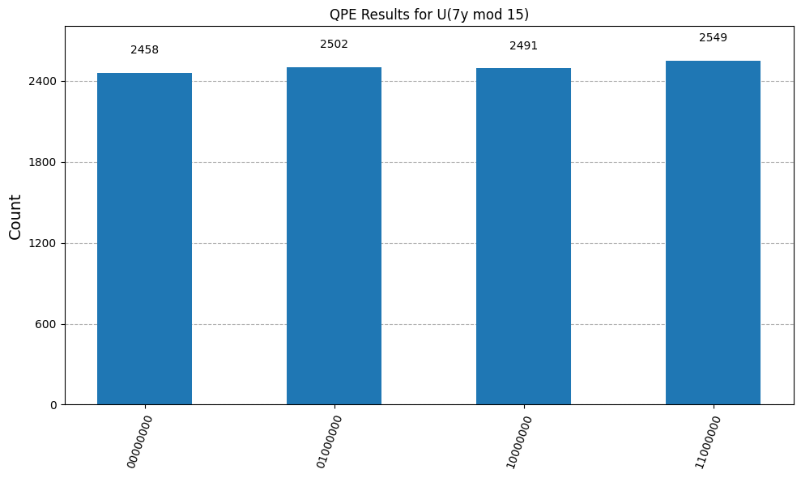

# Shor's Algorithm: A QPE-Based Demonstration

This repository contains a Python and Qiskit implementation of the quantum core of Shor's algorithm. The project serves as a portfolio piece to demonstrate a deep understanding of the algorithm's mechanics, specifically for the illustrative case of factoring **N=15** with a base of **a=7**.

The implementation closely follows the modern, structured approach of explaining Shor's algorithm via **Quantum Phase Estimation (QPE)**, as detailed in the [Qiskit Textbook](https://quantum.cloud.ibm.com/learning/en/courses/fundamentals-of-quantum-algorithms/phase-estimation-and-factoring/shor-algorithm) and the canonical textbook "Quantum Computation and Quantum Information" by Nielsen & Chuang.


---

## Core Concept: From Factoring to Period-Finding

The genius of Shor's algorithm lies in converting the classically hard problem of factoring an integer `N` into the quantumly efficient problem of finding the period `r` of the function:

`f(x) = a^x mod N`

The quantum part of the algorithm uses QPE to determine this period. QPE is a general-purpose quantum algorithm that finds the phase `φ` associated with an eigenvector of a unitary operator `U`. For Shor's algorithm, this phase is directly related to the period by `φ = s/r`, where `s` is an integer. Once `r` is found, classical post-processing can efficiently calculate the factors of `N`.


 

The histogram above shows the measurement outcomes from the QPE's counting register. The sharp peaks at specific values are the "answer" from the quantum computer, and they directly encode the period `r` we are looking for.

The connection between the measured integer `c` and the period `r` is given by the core relationship in QPE:

`c / 2^k ≈ φ = s / r`

where:
- `c` is the integer value of the measured bitstring.
- `k` is the number of qubits in the counting register (in our case, 8).
- `φ` is the phase of an eigenvector of the operator `U`.
- `s / r` is the fractional representation of that phase, with `r` being the period.

For our simulation with `k=8` (`2^8 = 256`), the measurement results correspond to:

- **`01000000` (Integer 64):** This gives a phase of `64 / 256 = 0.25`. As a fraction, this is **1/4**.
- **`10000000` (Integer 128):** This gives a phase of `128 / 256 = 0.5`. As a fraction, this is **2/4**.
- **`11000000` (Integer 192):** This gives a phase of `192 / 256 = 0.75`. As a fraction, this is **3/4**.

As the results show, every significant measurement outcome points to a fraction with a denominator of **r = 4**. This demonstrates that the QPE circuit successfully extracted the period of the unitary operator, providing the crucial piece of information needed for the classical part of Shor's algorithm to calculate the final factors.

---

## The Oracle Simplification: A Demonstrative Approach

A full implementation of the modular exponentiation operator `U` required for Shor's algorithm is notoriously complex and resource-intensive. To focus on the quantum mechanics of QPE, this project utilizes a **simplified, demonstrative oracle**.

Instead of building a true modular multiplier, the oracle `U` in this code implements a simple **cyclic permutation** of the basis states. For our 4-qubit system, this permutation is `|q₃q₂q₁q₀⟩ → |q₂q₁q₀q₃⟩`.

**Why this works:**
1.  **It is Unitary:** Any permutation of basis states is a unitary operation, satisfying a key requirement for QPE.
2.  **It has the Correct Period:** For the specific problem of `a=7, N=15`, the true modular multiplication operator has a period of **r=4**. The chosen cyclic permutation, when applied to the initial state `|1⟩`, also generates a cycle of states with a period of **r=4**.
3.  **QPE only needs the period:** The QPE algorithm's output depends only on the eigenvalues of the operator, which in turn depend on the period `r`. Since our simple operator and the real operator share the same period for this problem, QPE will yield the correct result.

This "shortcut" allows us to build a working, end-to-end demonstration that showcases the core quantum principles without the prohibitive complexity of a full arithmetic implementation.

---

## Installation & Requirements

To run this project, you'll need Python 3. It's highly recommended to use a virtual environment.

1.  **Clone the repository:**
    ```bash
    git clone [https://your-repository-url.git](https://your-repository-url.git)
    cd your-project-directory
    ```

2.  **Create and activate a virtual environment:**
    ```bash
    # For Unix/macOS
    python3 -m venv venv
    source venv/bin/activate

    # For Windows
    python -m venv venv
    .\venv\Scripts\activate
    ```

3.  **Install the required dependencies:**
    The `requirements.txt` file can be generated from your environment using:
    ```bash
    pip freeze > requirements.txt
    ```
    Then, install from the file:
    ```bash
    pip install -r requirements.txt
    ```

---

## Usage

This project is structured as a Jupyter Notebook (`groverssearch.ipynb`) for interactive execution.

1.  **Launch Jupyter:**
    After installing the dependencies, launch Jupyter from your terminal:
    ```bash
    jupyter notebook
    ```
    This will open a new tab in your web browser.

2.  **Open and Run the Notebook:**
    Navigate to the project directory and click on the `.ipynb` file to open it. You can run the entire notebook by selecting "Cell" -> "Run All" or execute each cell individually with `Shift + Enter`.

3.  **Modify Parameters:**
    The parameters `N`, `a`, and `n_counting` can be modified in the `main()` function cell to experiment with the algorithm.

---

## License

This project is licensed under the MIT License.
